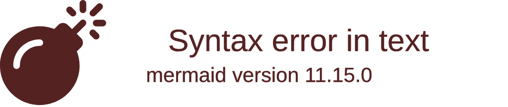

# Arquitetura (AWS) — Zentriz AI Content Factory

## Objetivo
Construir um pipeline diário (ou sob demanda) que:
- Escolhe tema → pesquisa e notas → gera matéria (blog) → gera roteiro → produz vídeo completo (YouTube) → cria cortes → publica por canal.

## Componentes sugeridos (MVP → Escala)
- **EventBridge Scheduler**: dispara diariamente.
- **Step Functions**: orquestra o pipeline com estados e retries.
- **AWS Lambda**: etapas leves (texto, validações, postagem, indexação Google).
- **ECS Fargate** (ou Lambda container) + **FFmpeg**: renderização de vídeo/cortes quando for pesado.
- **S3**: armazenamento de assets (md/html, áudio, vídeo, cortes, thumbnails, legendas, sitemap.xml).
- **DynamoDB**: tracking de jobs, estados, artefatos e URLs publicados.
- **Secrets Manager**: tokens OAuth/keys (incluindo Google Search Console API).
- **CloudWatch Logs + Metrics + Alarms**: observabilidade.
- **SNS/Slack webhook**: aprovação humana (notificar + link preview).
- **Blog (web app público)**: `https://blog.zentriz.com.br/` — web app separado (React + Vite + Material UI + MobX, deploy via AWS Amplify) onde as matérias são exibidas publicamente.
- **Admin UI (web app de gerenciamento)**: `https://blogeditor.zentriz.com.br` — web app separado (React + Vite + Material UI + MobX, deploy via AWS Amplify) para aprovação, reprocesso, visualização de jobs e gestão do calendário editorial (temas).

**Padrões de desenvolvimento frontend**:
- **Controle de estado**: MobX para estado global, `useState` para estado local.
- **Persistência**: localStorage para dados que precisam persistir entre sessões.
- **Requisições HTTP**: fetch API (nativo) como preferencial, axios apenas quando extremamente necessário.
- **Estrutura**: seguir padrão do projeto `zentriz-landpage` (`/Users/mac/workspace/current/zentriz/zentriz-landpage/`).

**Nota**: Blog e Admin UI são **dois web apps distintos**, cada um com seu próprio código-fonte e deploy. Ambos são subdomínios de `zentriz.com.br`.
- **Google Search Console API**: indexação automática de novas páginas do blog após publicação.

## Diagrama de alto nível (Mermaid)

## Provedores de IA e mídia (abstrações)
- **LLM Provider** (texto):
  - OpenAI, Anthropic, etc., atrás de uma interface única (`generateBlog`, `generateScript`, `generateCaptions`).
- **Voice Provider** (narração):
  - AWS Polly (default) ou provedores externos (ex.: ElevenLabs) encapsulados em um módulo.
- **Video Provider** (renderização):
  - `FFmpeg` em ECS/Lambda container (template de cena) ou APIs de avatar/vídeo externas.
- **Image/Thumb Provider**:
  - Geração via DALL·E/Stable Diffusion ou templates internos.

## Fluxo de aprovação com Admin UI (visão)

## Contratos entre módulos (interface mental)
- Tudo que “gera” escreve em S3 e registra em DynamoDB:
  - `jobId`, `topicId`, `stage`, `status`, `assetKeys[]`, `checks[]`.
- Tudo que “publica” precisa de:
  - `assetKey` (S3), `caption`, `title`, `tags`, `targetChannel`, `scheduleAt` (opcional).

## Estratégia de execução
- **Idempotência**: re-executar um job não duplica postagem.
- **Retries com backoff**: API rate limits e falhas temporárias.
- **DLQ/Dead-letter**: falha persistente vira item “needs_attention”.

## Custos (guideline)
- Texto/validações: Lambda + Step Functions (baixo).
- Renderização de vídeo: ECS Fargate (controlar vCPU/mem) ou MediaConvert (se preferir gerenciado).
- Armazenamento: S3 lifecycle (ex.: manter cortes 90d, masters 365d, logs 30d).

## Multi-tenant / multi-projeto (opcional)
Se você gerar conteúdo para mais de um canal/marca, trate como:
- `tenantId` (Zentriz) + `brandId` (FinOps/Monitor/etc.).

## Diagrama de Arquitetura de Componentes

