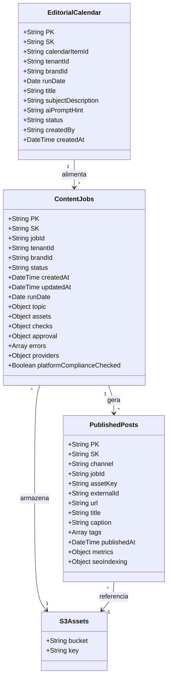

# Modelo de dados (DynamoDB)

## Tabela: `ContentJobs`
PK/SK (single-table recomendado):
- `PK = TENANT#<tenantId>`
- `SK = JOB#<jobId>`

Atributos:
- `jobId`, `tenantId`, `brandId`
- `status` (enum)
- `createdAt`, `updatedAt`, `runDate`
- `topic`: `{ title, keywords[], angle, language, source, calendarItemId }`
- `assets`: `{ blog:{...}, youtube:{...}, shorts:[...] }`
- `checks`: `{ plagiarism:false, safety_ok:true, numbers_ok:true, ... }`
- `approval`: `{ required:true, approved:false, approvedBy, approvedAt }`
- `errors[]`: `{ stage, message, at }`
- `providers`: `{ llm:"openai|anthropic|...", voice:"polly|elevenlabs|...", video:"ffmpeg|avatar_api|...", image:"dalle|sd|..." }`
- `platformComplianceChecked`: `true|false`

GSI sugeridas:
- `GSI1PK = STATUS#<status>` / `GSI1SK = RUNDATE#YYYY-MM-DD#JOB#<jobId>`
- `GSI2PK = TOPIC#<slug>` / `GSI2SK = CREATEDAT#...`

## Tabela: `PublishedPosts` (ou item tipo `POST#` na mesma tabela)
- `PK = TENANT#<tenantId>`
- `SK = POST#<channel>#<postId>`

Atributos:
- `channel` (BLOG, YOUTUBE, LINKEDIN, INSTAGRAM, TIKTOK, X, KWAI)
- `jobId`, `assetKey`
- `externalId`, `url`
- `title`, `caption`, `tags[]`
- `publishedAt`
- `metrics`: `{ views, likes, comments, shares }`
- `lastMetricsAt`
- `seoIndexing`: `{ submittedToGoogle: true|false, submittedAt, indexed: true|false, indexedAt, sitemapUpdated: true|false }` (apenas para `channel=BLOG`)

## Tabela: `EditorialCalendar`
- `PK = TENANT#<tenantId>`
- `SK = CALITEM#<runDate>#<calendarItemId>`

Atributos:
- `calendarItemId`
- `tenantId`, `brandId`
- `runDate` (data planejada do job diário)
- `title` (tema/título do conteúdo)
- `subjectDescription` (descrição de assunto para humanos)
- `aiPromptHint` (texto curto usado como “prompt base” para o LLM na seleção/geração)
- `status` (PLANNED, USED, SKIPPED, CANCELLED)
- `createdBy`, `createdAt`

## Convenção de chaves S3
- `s3://<bucket>/jobs/<jobId>/research/notes.md`
- `.../blog/post.md`
- `.../youtube/script.md`
- `.../youtube/video.mp4`
- `.../shorts/01.mp4`
- `.../shorts/manifest.json`

## Idempotência
- `publishKey = <channel>#<assetHash>`
- antes de publicar, checar se já existe `PublishedPosts` com `publishKey`.

## Diagrama de Modelos de Dados

