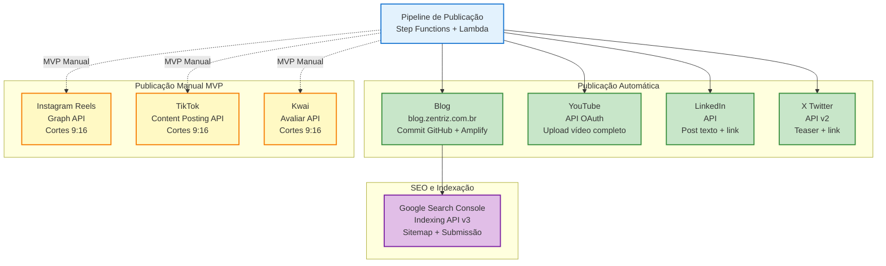

# Integrações por canal

## Blog (blog.zentriz.com.br)
**Web app separado** — subdomínio do site principal (`zentriz.com.br`).

**URL pública**: `https://blog.zentriz.com.br/` — onde as matérias geradas serão exibidas publicamente.

**Implementação**:
- **React + Vite + Material UI**: web app SPA (Single Page Application).
- **Controle de estado**: MobX para estado global.
- **Persistência**: localStorage para preferências do usuário.
- **Requisições HTTP**: fetch API (nativo), axios apenas se necessário.
- **Deploy**: AWS Amplify (integração com GitHub, build e deploy automático).
- **Conteúdo**: Markdown gerado pelo pipeline, commitado no GitHub e renderizado no blog.
- **Padrão de desenvolvimento**: seguir estrutura do projeto `zentriz-landpage` (`/Users/mac/workspace/current/zentriz/zentriz-landpage/`).

**Nota**: Este é um **web app independente** do Admin UI (`blogeditor.zentriz.com.br`). Cada um tem seu próprio deploy e código-fonte.

**Integração com pipeline**:
- Publicação via commit automático no GitHub (pasta `content/posts/` ou similar).
- Amplify detecta commit e faz rebuild automático.
- Posts criados como **draft** inicialmente (flag no frontmatter do Markdown), publicados apenas após aprovação via Admin UI.

**SEO e indexação no Google Search**:
- **Meta tags**: `blog.metadata.json` já inclui `seoTitle`, `seoDescription`, `tags`, `canonicalUrl`.
- **Structured Data (JSON-LD)**: gerar schema.org `Article` com:
  - `headline`, `author`, `datePublished`, `dateModified`, `image`, `publisher`.
- **Sitemap.xml dinâmico**: atualizar automaticamente após cada publicação (lista todas as URLs públicas do blog).
- **Google Search Console API**: submeter URL via Indexing API v3 após publicação.
- **robots.txt**: garantir acesso ao sitemap e não bloquear posts.
- Ver detalhes em `02_pipeline_conteudo.md` (etapa 11 — Indexação no Google Search).

## YouTube
- Upload via API (OAuth).
- Persistir `videoId` e `url` no DynamoDB.
- Usar `chapters` na descrição (quando aplicável).

## LinkedIn
- Post com texto + link do blog.
- Se postar vídeo: precisa pipeline de upload (asset) e URN antes do post.

## Instagram (Reels)
- Publicação via Graph API (normalmente conta Business/Creator).
- Fluxo típico: criar container (upload) → publicar.
- MVP: gerar cortes e postar manualmente até liberar integração.

## TikTok
- Content Posting API (Direct Post).
- Em geral precisa app com permissões e auditoria para postar publicamente.
- MVP: gerar cortes e publicar manualmente; fase 2: integrar.

## X
- Post teaser + link do blog ou YouTube.
- Cuidar limites do plano e rate limits.

## Kwai
- Integrações variam; pode não haver API orgânica “simples”.
- MVP: gerar cortes e publicar manualmente; avaliar plataformas de agendamento.

## Credenciais e tokens
- Centralizar em **Secrets Manager**.
- Rotacionar e auditar acessos.
- Nunca salvar refresh tokens em texto plano fora de Secrets Manager.

## Modo "Publicação Híbrida" (recomendado)
- Ferramenta gera tudo e cria "pacote do dia":
  - links dos assets no S3/CloudFront
  - captions prontas
  - títulos e hashtags
- Você decide: autopost (onde permitido) ou 1 clique de aprovação.

## Diagrama de Integrações por Canal

