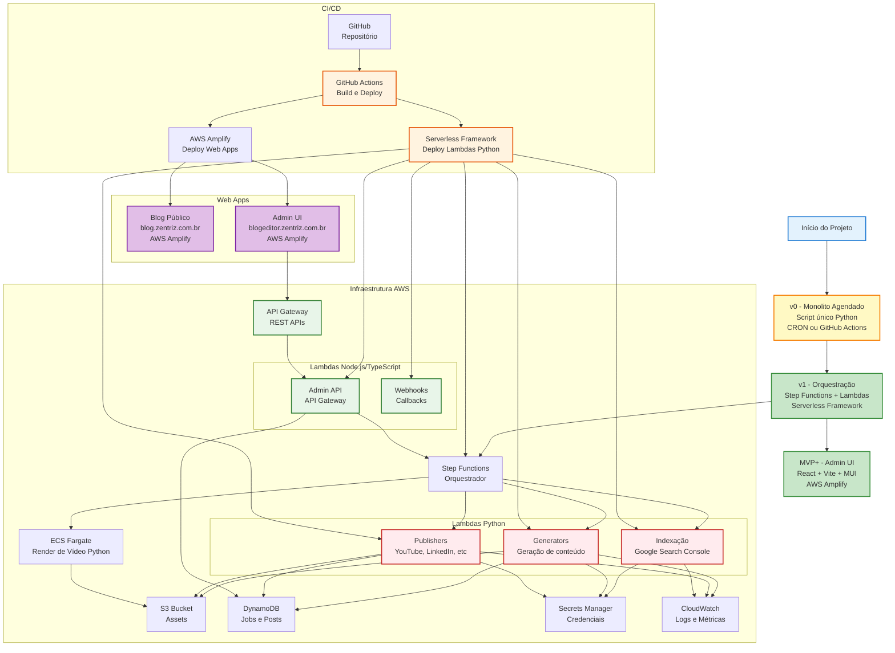

# Deploy e Operação

## Repositório sugerido
- `./docs` (esta documentação)
- `./infra` (IaC — Serverless Framework / Terraform)
- `./services`
  - `orchestrator` (Step Functions definitions)
  - `generators` (Python — texto/roteiro/captions)
  - `render` (Python ou ECS — FFmpeg)
  - `publishers` (Python — YouTube/LinkedIn/etc.)
  - `api` (Node.js/TypeScript — API Gateway)
    - `admin-api` (endpoints para Admin UI)
    - `webhooks` (callbacks e webhooks)
  - `blog` (web app do blog público — React + Vite + Material UI + MobX)
  - `admin-ui` (web app do painel de gerenciamento — React + Vite + Material UI + MobX)

**Estrutura dos web apps** (seguir padrão do `zentriz-landpage`):
```
services/[blog|admin-ui]/
├── src/
│   ├── components/     # Componentes reutilizáveis
│   ├── pages/          # Componentes de página
│   ├── hooks/          # React hooks personalizados
│   ├── stores/         # Stores MobX (controle de estado)
│   ├── services/       # Serviços de API (fetch)
│   ├── utils/          # Utilitários
│   └── styles/         # Estilos globais (SCSS)
├── package.json
├── vite.config.ts
└── tsconfig.json
```

## Deploy (MVP)
- Serverless Framework para Lambdas + Step Functions.
- Bucket S3 para assets.
- DynamoDB tables.
- Secrets Manager secrets por canal.
- CloudWatch alarms (falha do state machine, erro de publish).

## Estratégia de Linguagem para Lambdas
**Decisão técnica**: usar linguagens diferentes conforme o tipo de Lambda:

- **Node.js/TypeScript**: para Lambdas expostas via **API Gateway** (REST APIs).
  - Exemplos: endpoints do Admin UI, webhooks, APIs de consulta.
  - Motivo: melhor integração com frontend React, tipagem TypeScript, ecossistema npm.

- **Python**: para Lambdas de **processamento** (não expostas via API Gateway).
  - Exemplos: geradores de conteúdo (texto, roteiro, captions), publishers (YouTube, LinkedIn, etc.), indexação Google Search.
  - Motivo: excelente suporte para processamento de texto, bibliotecas de IA (OpenAI, Anthropic), manipulação de dados, APIs de LLM.

**Estrutura de serviços**:
```
services/
├── generators/          # Python (processamento de texto/IA)
├── publishers/          # Python (integrações com APIs externas)
├── render/             # Python ou ECS (FFmpeg)
└── api/                # Node.js/TypeScript (API Gateway)
    ├── admin-api/      # Endpoints para Admin UI
    └── webhooks/       # Webhooks e callbacks
```

## Estrutura de domínios e URLs
- **Site principal**: `https://zentriz.com.br/` (projeto existente em `/Users/mac/workspace/current/zentriz/zentriz-landpage/`).
- **Blog público** (`https://blog.zentriz.com.br/`): **web app separado** — exibição pública das matérias geradas.
  - Subdomínio do site principal.
  - Implementado como React + Vite + Material UI, deploy via AWS Amplify.
- **Admin UI** (`https://blogeditor.zentriz.com.br`): **web app separado** — painel de gerenciamento (calendário editorial, aprovação, reprocesso).
  - Subdomínio do site principal.
  - Deploy via AWS Amplify (React + Vite + MUI).

**Importante**: Blog e Admin UI são **dois web apps distintos**, cada um com seu próprio código-fonte, deploy e configuração.

## Caminho de implementação (MVP técnico)
- **v0 — Monolito agendado**:
  - Script único (ex.: Python/Node) agendado (CRON ou GitHub Actions) que:
    - seleciona tema → gera notas → matéria do blog → roteiro YouTube → posts LinkedIn/X.
    - grava assets em S3 e metadados em DynamoDB seguindo as convenções deste blueprint.
- **v1 — Orquestração com Step Functions**:
  - migrar etapas do script v0 para estados individuais (Lambdas/ECS) na state machine.
  - manter os mesmos contratos de entrada/saída para facilitar evolução.
- **Admin UI (MVP+)**:
  - app React + Vite + MUI hospedado em **AWS Amplify** (deploy automático via GitHub).
  - **URL**: `https://blogeditor.zentriz.com.br`
  - lista jobs, mostra preview (link HTML), permite aprovar/rejeitar/reprocessar.
  - gestão do calendário editorial (criar/editar temas com descrição e prompt para IA).

## Observabilidade mínima
- Dashboard CloudWatch:
  - Jobs/dia
  - Falhas por estágio
  - Tempo médio de render
- Alarmes:
  - `StateMachineFailed > 0`
  - `PublishFailed > 0`

## Operação diária
- O job roda e produz:
  - link do post do blog (draft)
  - link do vídeo (unlisted, se preferir)
  - pacote de cortes
- Você aprova → publica.

## Estratégia de rollback
- Blog: publicar como draft e “publicar” só após aprovação.
- YouTube: subir como **unlisted** até aprovação.
- Redes: postar só após aprovação.

## SEO e indexação no Google Search
**Objetivo**: garantir que todas as novas páginas do blog sejam indexadas rapidamente pelo Google.

**Componentes necessários**:
- **Google Search Console API** (Indexing API v3):
  - Credenciais OAuth 2.0 armazenadas em Secrets Manager.
  - Lambda que submete URL após publicação bem-sucedida.
- **Sitemap.xml dinâmico**:
  - Gerado automaticamente a partir de `PublishedPosts` no DynamoDB (filtro: `channel=BLOG`, `status=published`).
  - Hospedado em `https://blog.zentriz.com.br/sitemap.xml`.
  - Atualizado após cada nova publicação.
- **Ping automático do sitemap**:
  - Após atualizar sitemap, fazer ping: `https://www.google.com/ping?sitemap=https://blog.zentriz.com.br/sitemap.xml`.
- **Structured Data (JSON-LD)**:
  - Incluir schema.org `Article` no HTML de cada post (gerado na etapa de publicação do blog).
- **robots.txt**:
  - Garantir que `/sitemap.xml` está acessível.
  - Não bloquear posts individuais.

**Implementação**:
- Lambda `index-new-post` executada após publicação do blog (Step Functions).
- Se falhar, registrar em DynamoDB para retry via cron diário.
- Ver `02_pipeline_conteudo.md` (etapa 11) e `04_integracoes_canais.md` (seção Blog).

**Monitoramento**:
- CloudWatch métrica: URLs submetidas vs URLs indexadas (via Search Console API).
- Alarme se taxa de indexação < 80% após 7 dias.

## Custos: como manter controlado
- Render em ECS com task size fixo (ex.: 1–2 vCPU, 2–4GB) e tempo limite.
- S3 lifecycle: limpar intermediários.
- Step Functions: evitar loops longos; preferir batch por canal.

## Diagrama de Deploy e Operação


