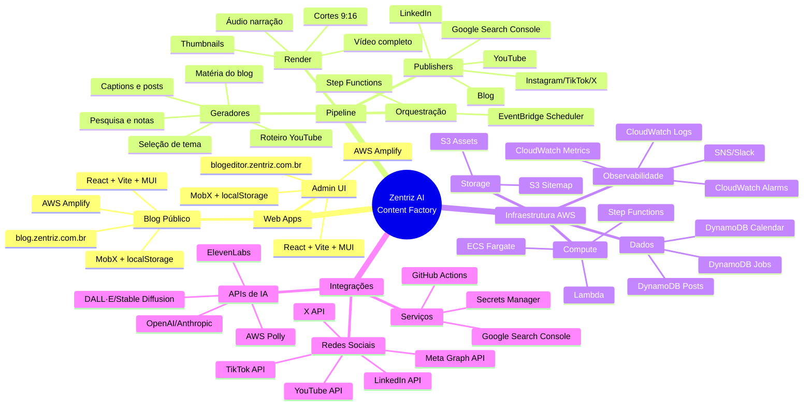

# Zentriz AI Content Factory (Blog + YouTube + Cortes) — Documentação

Este pacote descreve um **blueprint completo** (MVP → Escala) para uma ferramenta que:
- Gera diariamente **matéria do blog** (fonte) + **vídeo completo** (YouTube).
- Gera **cortes** (9:16) para Instagram/TikTok/Kwai e teaser para X.
- Publica automaticamente onde for possível via API e mantém **modo revisão humana** (1 clique) para reduzir risco.

## Visão geral do funil (seu modelo atual)
- **Instagram / X / TikTok / Kwai**: cortes e teasers para promover **YouTube** e **Blog**.
- **YouTube**: vídeo completo.
- **Blog**: matéria escrita (canonical).
- **LinkedIn**: trecho da matéria para promover o blog.

## Conteúdos deste ./docs
- `01_arquitetura.md` — desenho AWS + componentes e fluxos.
- `02_pipeline_conteudo.md` — passo a passo (daily run), estados e validações.
- `03_modelos_dados.md` — tabelas/itens e estados no DynamoDB.
- `04_integracoes_canais.md` — publicação por plataforma (APIs, tokens, limitações).
- `05_prompts.md` — prompts base (matéria, roteiro, cortes, CTA, LinkedIn, X).
- `06_seguranca_compliance.md` — tokens, segredos, guardrails, copyright, moderação.
- `07_deploy_operacao.md` — deploy serverless, observabilidade, retries e custos.
- `08_roadmap.md` — MVP → Fase 2/3 (IG, TikTok audit, etc.).

## Decisões de stack e implementação
- **Frontend web (todos os projetos)**: `React + Vite + Material UI` ([MUI](https://mui.com/material-ui/)).
  - **Blog público**: React + Vite + Material UI, deploy via AWS Amplify.
  - **Admin UI**: React + Vite + Material UI, deploy via AWS Amplify.
  - **Padrão de desenvolvimento**: seguir estrutura do projeto `zentriz-landpage` (`/Users/mac/workspace/current/zentriz/zentriz-landpage/`).
- **Gerenciador de pacotes**: sempre `pnpm` para projetos Node/React.
- **Controle de estado**: **MobX** para gerenciamento de estado global.
- **Persistência local**: **localStorage** para dados que precisam persistir entre sessões.
- **Requisições HTTP**:
  - **Fetch API** como preferencial (nativo do browser).
  - **Axios** apenas quando extremamente necessário (ex.: interceptors complexos, cancelamento de requisições).
- **TypeScript**: sempre usar TypeScript para type safety.
- **CI/CD**: GitHub Actions para:
  - build/test frontend com `pnpm`.
  - deploy de frontend via **AWS Amplify** (integração com GitHub, build e deploy automático).
  - deploy de backend serverless (Lambdas, Step Functions, etc.).
- **Cloud**: tudo publicado na **AWS** (infra orquestração, storage, dados e hospedagem web).

## URLs e domínios do projeto
- **Site principal**: `https://zentriz.com.br/` (projeto existente em `/Users/mac/workspace/current/zentriz/zentriz-landpage/`).
- **Blog público** (`https://blog.zentriz.com.br/`): **web app separado** onde as matérias geradas serão exibidas publicamente.
  - Subdomínio do site principal.
  - Implementado como **React + Vite + Material UI**, deploy via AWS Amplify.
- **Admin UI** (`https://blogeditor.zentriz.com.br`): **web app separado** — painel de gerenciamento (calendário editorial, aprovação de jobs, reprocesso).
  - Subdomínio do site principal.
  - Implementado como React + Vite + Material UI, deploy via AWS Amplify.

## Requisitos técnicos e ambiente de desenvolvimento

### Requisitos de sistema
- **Sistema operacional**: macOS, Linux ou Windows (WSL2 recomendado para Windows).
- **Node.js**: versão 18.x ou superior (LTS recomendado).
- **pnpm**: versão 8.x ou superior (`npm install -g pnpm`).
- **Python**: versão 3.10 ou superior (para scripts v0 e processamento de vídeo, se necessário).
- **Git**: versão 2.30+ para controle de versão.

### Ferramentas de desenvolvimento
- **AWS CLI**: versão 2.x configurado com credenciais (`aws configure`).
- **Serverless Framework** ou **Terraform**: para IaC (Infrastructure as Code).
  - Serverless: `npm install -g serverless` (recomendado para MVP).
  - Terraform: versão 1.5+ (alternativa para infra mais complexa).
- **Docker** (opcional): para testes locais de Lambdas/containers e renderização de vídeo.
- **FFmpeg** (opcional, para desenvolvimento local): versão 6.x+ para testes de renderização de vídeo.

### Contas e serviços necessários
- **AWS Account**:
  - Acesso para criar: Lambda, Step Functions, EventBridge, S3, DynamoDB, Secrets Manager, CloudWatch, API Gateway, **AWS Amplify**, ECS Fargate (se necessário).
  - IAM com permissões adequadas (ver `06_seguranca_compliance.md`).
- **Google Search Console**:
  - Conta configurada para `blog.zentriz.com.br`.
  - Service Account com acesso à Indexing API v3 (para indexação automática).
- **APIs de IA** (escolher conforme necessidade):
  - **OpenAI** (GPT-4) ou **Anthropic** (Claude): para geração de texto.
  - **AWS Polly** (ou **ElevenLabs**): para síntese de voz.
  - **DALL·E** ou **Stable Diffusion** (opcional): para geração de imagens/thumbnails.
- **APIs de redes sociais** (conforme roadmap):
  - **YouTube Data API v3**: OAuth 2.0 configurado.
  - **LinkedIn API**: app registrado.
  - **X (Twitter) API v2**: app e tokens.
  - **Meta Graph API** (Instagram): app Business/Creator.
  - **TikTok Content Posting API** (Fase 2+).

### Configurações iniciais

#### 1. Repositório e estrutura
```bash
# Clone ou crie o repositório
git clone <repo-url> zentriz-ai-content-factory
cd zentriz-ai-content-factory

# Estrutura esperada (criar conforme necessário):
# ./docs/          (esta documentação)
# ./infra/         (IaC: Serverless Framework ou Terraform)
# ./services/      (código-fonte dos serviços)
#   ./orchestrator/
#   ./generators/
#   ./render/
#   ./publishers/
#   ./blog/        (web app do blog público - React + Vite + Material UI + MobX)
#     ./src/
#       ./components/  # Componentes reutilizáveis
#       ./pages/       # Componentes de página
#       ./stores/      # Stores MobX
#       ./services/    # Serviços de API (fetch)
#       ./utils/       # Utilitários
#       ./styles/      # Estilos globais (SCSS)
#   ./admin-ui/    (web app do painel de gerenciamento - React + Vite + MUI + MobX)
#     ./src/       # Mesma estrutura do blog
```

#### 2. Variáveis de ambiente
Criar arquivo `.env.example` (e `.env` local) com:
```bash
# AWS
AWS_REGION=us-east-1
AWS_PROFILE=default  # ou nome do profile

# LLM Provider
OPENAI_API_KEY=sk-...  # ou ANTHROPIC_API_KEY=sk-ant-...
LLM_PROVIDER=openai  # ou anthropic

# Voice Provider
VOICE_PROVIDER=polly  # ou elevenlabs
ELEVENLABS_API_KEY=...  # se usar ElevenLabs

# Google Search Console
GOOGLE_SERVICE_ACCOUNT_EMAIL=...
GOOGLE_PRIVATE_KEY_PATH=./secrets/google-key.json

# Redes sociais (conforme integração)
YOUTUBE_CLIENT_ID=...
YOUTUBE_CLIENT_SECRET=...
LINKEDIN_CLIENT_ID=...
LINKEDIN_CLIENT_SECRET=...
X_API_KEY=...
X_API_SECRET=...

# URLs
BLOG_URL=https://blog.zentriz.com.br
ADMIN_UI_URL=https://blogeditor.zentriz.com.br
```

#### 3. AWS - Configuração inicial
```bash
# Configurar AWS CLI
aws configure

# Criar bucket S3 para assets (se não existir)
aws s3 mb s3://zentriz-content-factory-assets --region us-east-1

# Criar tabelas DynamoDB (via IaC ou manualmente)
# Ver estrutura em 03_modelos_dados.md
```

#### 4. Secrets Manager (AWS)
Armazenar credenciais sensíveis:
```bash
# Exemplo: salvar API key do OpenAI
aws secretsmanager create-secret \
  --name zentriz/openai-api-key \
  --secret-string "sk-..."

# Ver 06_seguranca_compliance.md para lista completa
```

#### 5. Google Search Console - Service Account
1. Criar projeto no Google Cloud Console.
2. Habilitar "Google Search Console API" e "Indexing API".
3. Criar Service Account e baixar JSON key.
4. Adicionar Service Account no Google Search Console (propriedade `blog.zentriz.com.br`) com permissão "Owner".
5. Salvar JSON key em Secrets Manager ou localmente (não commitar).

### Ambiente de desenvolvimento local

#### Frontend (Blog e Admin UI)
**Padrão baseado no projeto `zentriz-landpage`** (`/Users/mac/workspace/current/zentriz/zentriz-landpage/`).

```bash
# Blog
cd services/blog
pnpm install
pnpm dev  # roda em http://localhost:3000 (ou porta configurada)

# Admin UI
cd services/admin-ui
pnpm install
pnpm dev  # roda em http://localhost:3000 (ou porta configurada)
```

**Padrões de código frontend**:
- **Estrutura de pastas**: seguir padrão do `zentriz-landpage`:
  - `src/components/` - Componentes reutilizáveis
  - `src/pages/` - Componentes de página
  - `src/hooks/` - React hooks personalizados
  - `src/stores/` - Stores MobX (controle de estado)
  - `src/services/` - Serviços de API (usando fetch)
  - `src/utils/` - Utilitários
  - `src/styles/` - Estilos globais (SCSS)
- **Controle de estado**: MobX stores para estado global, `useState` para estado local.
- **Persistência**: localStorage para dados que precisam persistir (ex.: preferências do usuário).
- **Requisições HTTP**: usar `fetch` nativo. Axios apenas se necessário (interceptors complexos, cancelamento).
- **TypeScript**: sempre usar TypeScript com tipagem forte.
- **Estilização**: Material UI `sx` prop + TailwindCSS + SCSS para estilos globais.

#### Backend (Lambdas/Step Functions)
```bash
# Com Serverless Framework
cd infra
npm install
serverless offline  # para testes locais (se configurado)

# Ou rodar Lambdas individualmente
cd services/generators
npm install
node src/index.js  # teste local
```

#### Testes
- **Unit tests**: Jest ou Vitest (frontend).
- **Integration tests**: testes contra DynamoDB local (DynamoDB Local) ou ambiente de staging.
- **E2E**: Cypress ou Playwright (opcional, para Admin UI).

### CI/CD - GitHub Actions e AWS Amplify
**Frontend (Admin UI)**:
- **AWS Amplify**: conectar repositório GitHub ao Amplify Console.
  - Amplify detecta commits na branch `main` (ou configurada).
  - Build automático: `pnpm install` → `pnpm build`.
  - Deploy automático para CDN (Amplify gerencia CloudFront internamente).
  - Custom domain: configurar `blogeditor.zentriz.com.br` no Amplify.
- Alternativa (se não usar Amplify): GitHub Actions workflow que faz build e upload para S3 + invalidação CloudFront.

**Backend**:
- GitHub Actions workflows em `.github/workflows/`:
  - Deploy de Lambdas/Step Functions via Serverless Framework ou Terraform.
  - Secrets: usar GitHub Secrets para credenciais (não hardcode).

### Checklist de setup inicial
- [ ] Node.js 18+ e pnpm instalados.
- [ ] AWS CLI configurado com credenciais válidas.
- [ ] Conta AWS com permissões IAM adequadas.
- [ ] Google Search Console configurado e Service Account criado.
- [ ] API keys de LLM (OpenAI/Anthropic) obtidas.
- [ ] Bucket S3 criado para assets.
- [ ] Tabelas DynamoDB criadas (via IaC ou manualmente).
- [ ] Secrets Manager configurado com credenciais sensíveis.
- [ ] Repositório GitHub criado e workflows de CI/CD configurados.
- [ ] **AWS Amplify** configurado para **Admin UI** (`blogeditor.zentriz.com.br`):
  - App criado no Amplify Console conectado ao repositório GitHub (branch `services/admin-ui`).
  - Build settings configurados (`pnpm install`, `pnpm build`).
  - Custom domain `blogeditor.zentriz.com.br` configurado no Amplify.
- [ ] **Blog público** (`blog.zentriz.com.br`) configurado:
  - Web app React + Vite + Material UI deployado via AWS Amplify.
  - Subdomínio `blog.zentriz.com.br` apontando corretamente.
- [ ] Domínios configurados (blog.zentriz.com.br, blogeditor.zentriz.com.br) como subdomínios de zentriz.com.br.

### Próximos passos
Após configurar o ambiente, seguir `07_deploy_operacao.md` para deploy inicial e `08_roadmap.md` para evolução do MVP.

## Como usar este blueprint
1) Leia `01_arquitetura.md` e `02_pipeline_conteudo.md` (visão e execução).
2) Defina o **MVP**: Blog + YouTube + geração de cortes (publicação opcional).
3) Configure credenciais e integrações conforme `04_integracoes_canais.md`.
4) Ajuste prompts em `05_prompts.md` para o tom da Zentriz (FinOps/Cloud/DevOps/IA).
5) Suba com `07_deploy_operacao.md` e acompanhe custos/qualidade.

## Padrões adotados (opinião forte)
- **Blog é a fonte** (canonical) → sempre gerar primeiro.
- **Human-in-the-loop** no MVP (aprovação) → só depois autopost.
- **Traçabilidade**: todo asset (texto/áudio/vídeo/corte) com hash, status e links no DynamoDB.
- **Observabilidade**: logs estruturados + métricas por etapa + DLQ para falhas.

---
> Observação: Este pacote é documentação. Ele não inclui código-fonte. A ideia é você colar isso num repositório e usar (ex.: Cursor) para gerar os módulos seguindo estes contratos.

## Suite de Sistemas - Visão Geral


